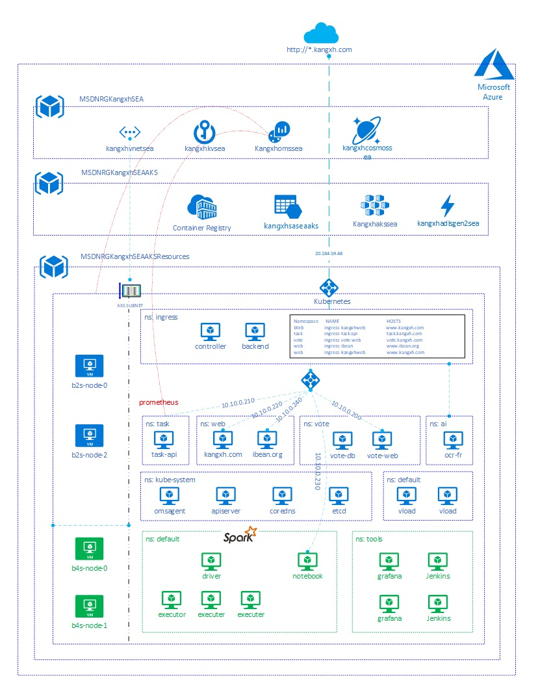

### Demo Environment for AKS. 

    AKS deployed in Azure South East Asia. Feature gap can exist between global Azure and sovereign cloud. 

    This PoC is used to demo basic AKS functions, including availability, scalability, CICD. It is also used for other app service backend, like APIM, Application gateway. 

    Resource are hosted in MSDN subscription with 150$/Month quota. Unnecessary resource are turn off and need manual start.

    Use this AKS to host personal web site: kangxh.com and ibean.org.

### Folder structure

Workloads:  

    - task          --  demo application for api  
    - vote          --  demo application for web  
    - cognitive     --  demo app for AI solution  
    - web           --  personal web sites   

Infra:  
    - monitor       --  log analytic with aks  
    - cicd          --  CICD with Azure DevOps & Jenkins  
    - cheatsheet    --  environment setup and demo script  
    - misc          --  azure service co-work with aks  

### Web Site URL Path

    www.kangxh.com                  <--->   main domain hosted by app service
    vote.kangxh.com                 <--->   vote web site
    task.kangxh.com/api/tasks       <--->   task api
    task.kangxh.com/metrics         <--->   promethues export endpoint
    ocr-fr.kangxh.com               <--->   OCR Form Recognizer Label tool. 

### Deployment Topology

